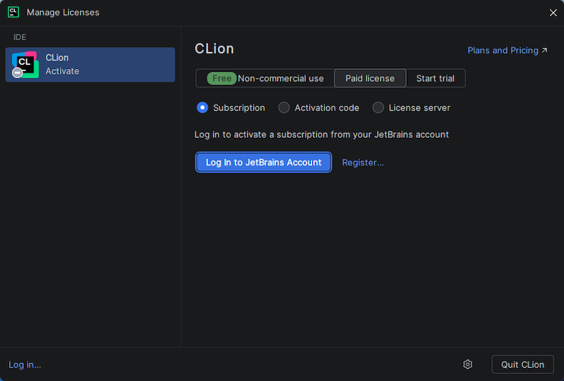
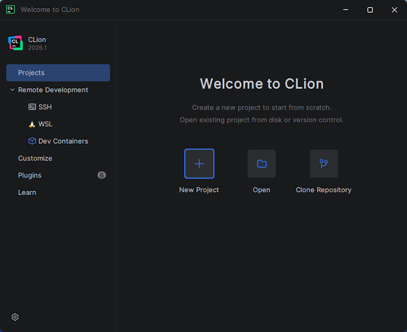

This page contains a step-by-step guide through the installation of CLion and other JetBrains IDEs.
  

## Install JetBrains Toolbox App and the CLion IDE

---

The quickest and easiest way to install and update multiple JetBrains IDEs is to use the 
**JetBrains Toolbox App**.  Follow the steps below to install the **Toolbox App** and your IDEs.

* **Step 1:** Download and install the [JetBrains Toolbox App](https://www.jetbrains.com/toolbox-app/). 
The toolbox is available for Windows, macOS, and Linux. 

* **Step 2:** After installation, run the **Toolbox App**.  It will appear as a cube in the 
taskbar or menu bar of your operating system.

* **Step 3:** Click on the cube to see a list of IDEs that you can install.  If this is the
first time that you've installed the **Toolbox App**, you may need to agree to the licensing
terms before you'll see the list of IDEs.

* **Step 4:** From within the **Toolbox App**, click the **Install** button next to **CLion**
to install the required IDE.  You should see a progress bar in the header of the **Toolbox App**.

* **Step 5:** When the installation is complete, you should be able to run the newly installed IDE either from within the **Toolbox App**, or from the location at which it was installed on your operating system (i.e. macOS Applications folder or Windows Start Menu). Run the **CLion** IDE now.

* **Step 6:** If you're not already running **CLion**, start it now.  If this is the first time you've run **CLion**, respond to the prompts regarding **"Data Sharing"** and you should then see a screen that looks like the following.

  > 

  Make sure the **"Subscription"** radio button is selected and click the **"Log In to JetBrains Account"** button, input your JetBrains account information in the web browser that appears, and then click **Activate** back in the **CLion** application. Finally, click **"Close"** to finish the activation of the **CLion** IDE. You should see a **"Welcome to CLion"** window similar to the image below.

  > 

  

---

**If on macOS, continue to:** [Install YCPCS Marmoset Plugin](./ycpcs_marmoset_plugin.html)

**If on a Windows 11, continue to:** [Configure CLion IDE](../win11/win11_clion_config.html)

--- 

