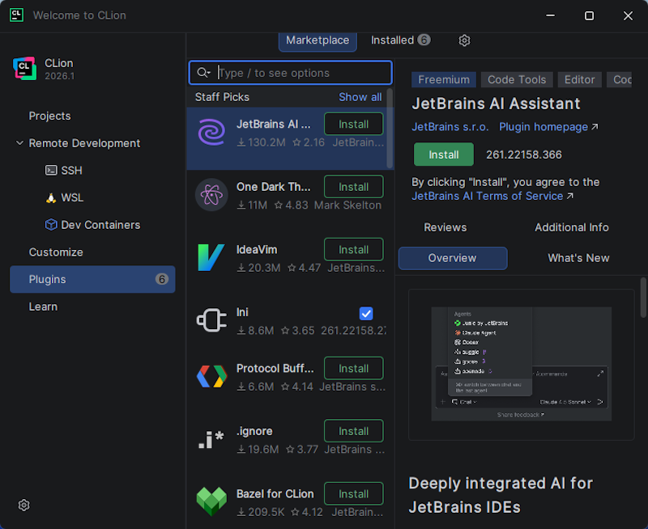
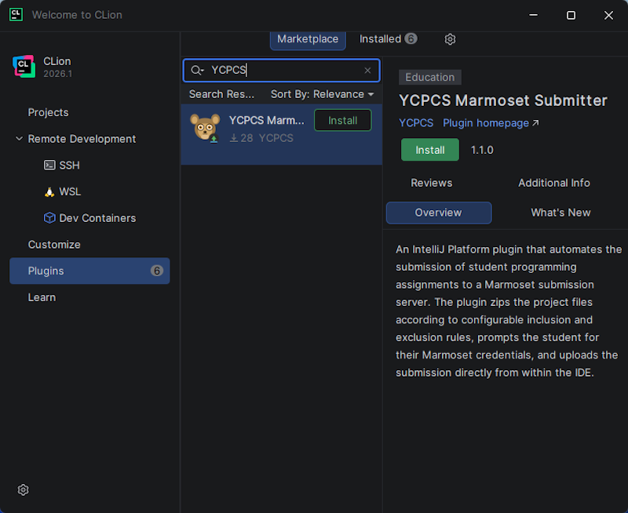
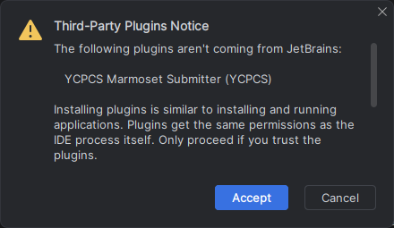
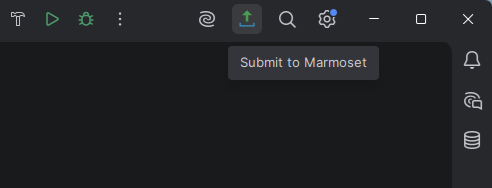
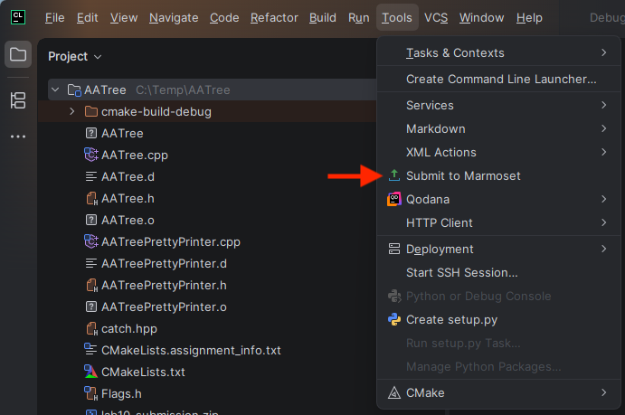
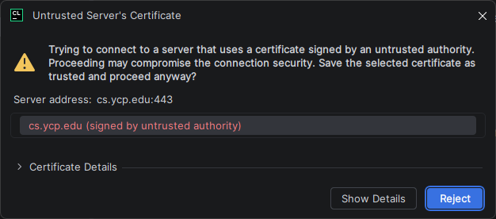
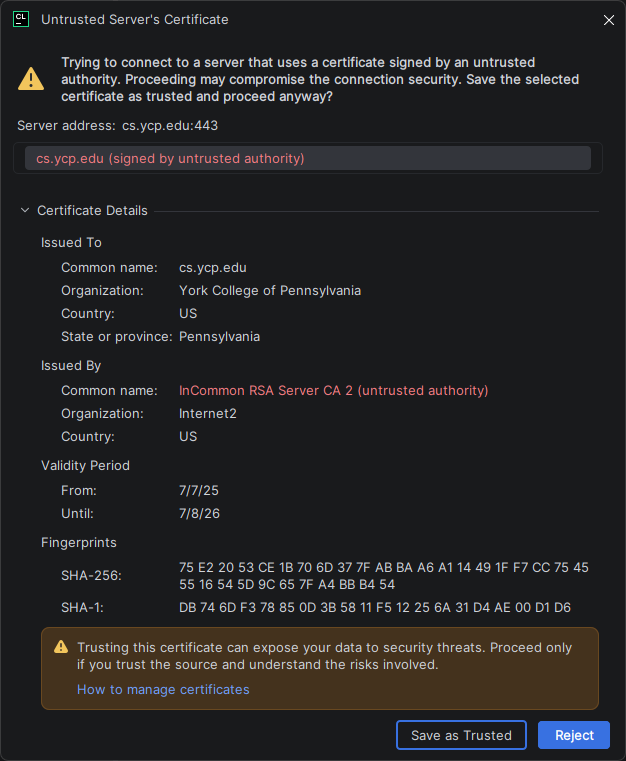

This page contains a step-by-step guide through the installation of the YCPCS Marmoset Plugin.
  

## Part 1: Install the YCP CS Marmoset Plugin

---

The [YCP CS Marmoset plugin](https://plugins.jetbrains.com/plugin/30901-ycpcs-marmoset-submitter) simplifies assignment submissions to the YCPCS Marmoset submission server.

* **Step 1:** Open your CLion IDE. You should see a "Welcome to CLion" window similar to the image below.

    > 

  Select the **Plugins** menu option in the left sidebar.

    > 

  

* **Step 2:** In the **Marketplace** search bar, search for "YCPCS Marmoset Submitter".  The result window may not immediately show the icon for the plugin.  

    > 
  
    Click the green "Install" button to install the plugin.  You may receive a warning similar to the image below - click **Accept**.

    > 

   

## Part 2: Submitting a Project

---

The [YCP CS Marmoset plugin](https://plugins.jetbrains.com/plugin/30901-ycpcs-marmoset-submitter) only works on projects that have been properly configured by your course instructor.

* **Step 1:** To submit a project, look for the following icon in the Toolbar of your IDE.
      
    

    It should be visible in the top right region of your Toolbar as shown in the following image.

    > 

    Alternatively, you will find an option to invoke the plugin in **Menu → Tools → Submit to Marmoset** as shown below.

    > 

  

* **Step 2:** The first time you use the **YCP CS Marmoset plugin**, you may be prompted with the following warning regarding the security certificate on **cs.ycp.edu**.

    > 
 
    Click on **Show Details** and then **Save as Trusted** as shown below. Future attempts to submit from your IDE should not require this step.

    > 

  

* **Step 3:** Provide your Marmoset **username** and **password** when prompted to submit your project.

 

---

### Done! 

--- 

