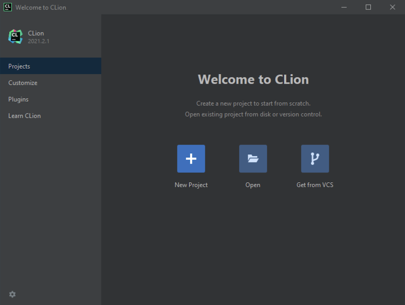
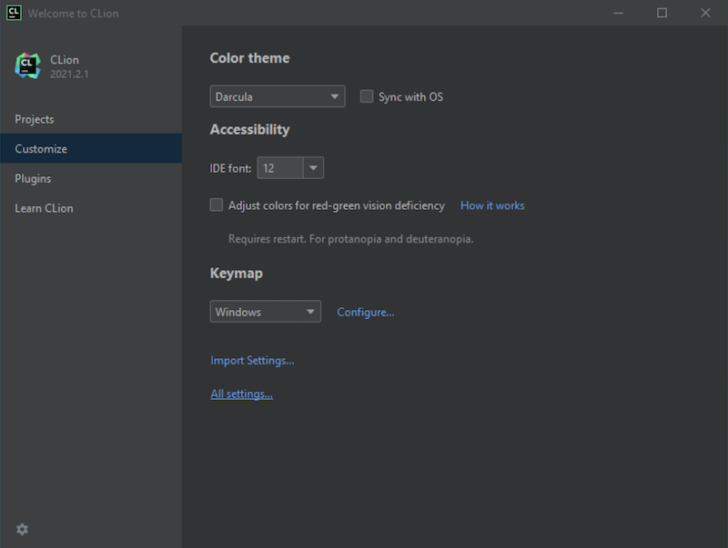
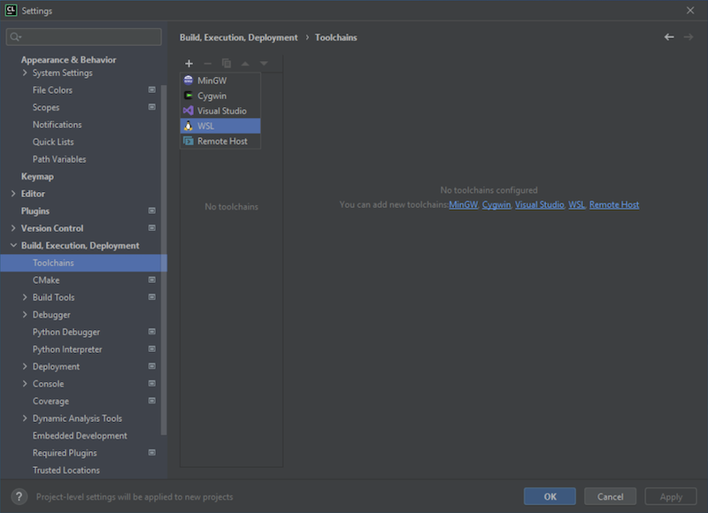
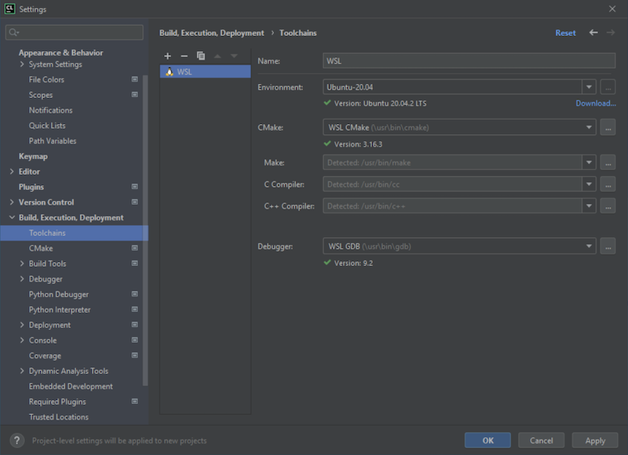
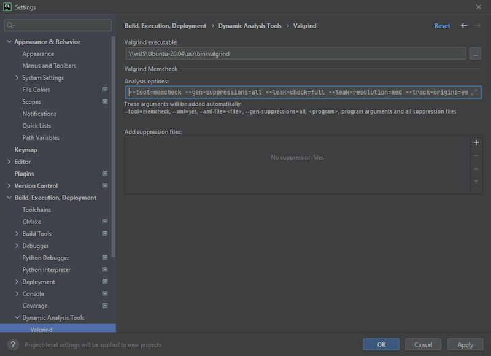
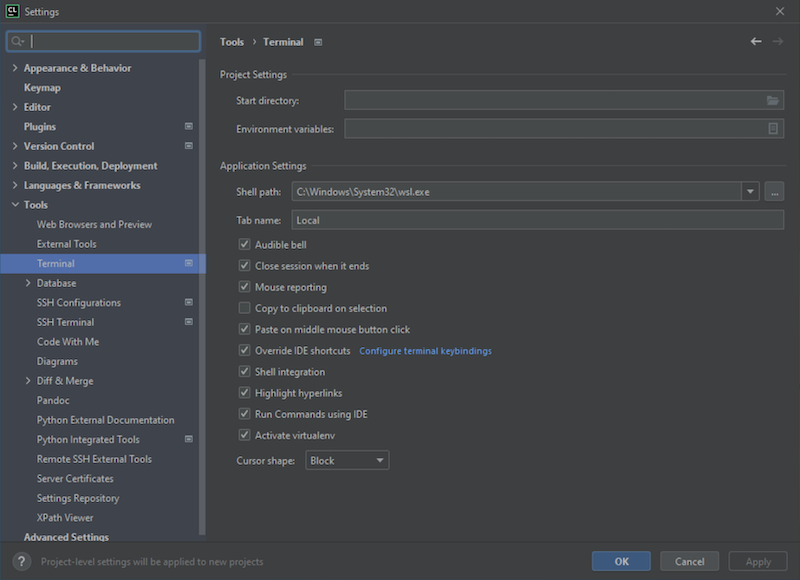

This page contains a step-by-step guide through the configuration of CLion on KEC lab 
computers.
<br><br>


## Part 1: Acquire a Free Student License from Jetbrains

---

[JetBrains](https://www.jetbrains.com) offers a wide variety of IDEs for many different 
programming languages.  Some of the IDEs they offer require a license.  However, JetBrains 
offers a free education license for students.  To get your free student license follow
the steps below.


* **Step 1:** Visit the JetBrains licensing page located 
[here](https://www.jetbrains.com/shop/eform/students).


* **Step 2:** Complete the web form **using your YCP email address**.


* **Step 3:** Check your YCP email to verify that your free JetBrains education license 
has been approved. 


* **Step 4:** Follow the directions in the email to complete setup of your JetBrains account.
You will need this account and password to confirm your license eligibility when you run
a JetBrains IDE for the first time.
<br><br><br>


## Part 2: Run the CLion IDE for the First Time

---

* **Step 1:** Run the CLion IDE from the Windows Start/Applications menu: **Start -> JetBrains -> CLion**.


* **Step 2:** Respond to the prompts regarding "Data Sharing" and settings.  Then "Activate" 
your JetBrains IDE using the JetBrains account that you created earlier.  Make sure the 
"JB Account" radio button is selected, click the **Log In to Jetbrains Account...** button, 
input your account info in the web browser that appears, and then click **Activate** back in
the CLion application. Finally, click "Continue" to finish the activation and run the 
CLion IDE.
<br><br><br>


## Part 3: Configure Toolchains in CLion

---

The first time you run CLion you'll need to configure a variety of settings to get your 
IDE ready to compile and run your projects.  Setup will differ depending on your operating 
system.  This guide is for Windows 10 and 11 running WSL2 with Ubuntu 20.04 LTS installed.


* **Step 1:** Start up your WSL2 Linux terminal and minimize it for now.


* **Step 2:** If you're not already running CLion, start it now from your start menu. 
Assuming this is the first time you've run CLion, you should see a 
"Welcome to CLion" window similar to the image below.

> 
<br><br>


* **Step 3:** Select the **Customize** menu option in the left sidebar.  Then click on 
**All settings...** at the bottom of the new dialog box.

> 
<br><br>


* **Step 4:** In the **Settings** dialog box that opens, expand **Build, Execution, Deployment**,
and then select **Toolchains** in the left sidebar. At this point you may or may not have any 
toolchains setup. Click on the **+** symbol near the top of the dialog box and create a 
new **WSL** toolchain.

> 
<br><br>


* **Step 5:** All the values for your new WSL toolchain _SHOULD_ auto-populate. If they
don't, make sure you're running an instance of your Linux terminal as mentioned in Step 1.
Verify that your settings match those shown in the image below.  If you have multiple 
toolchains installed, I recommend moving your new WSL toolchain to the top of the list so
that it becomes the _default_ toolchain.  When done, click **Apply**.

> 
<br><br>


* **Step 6:** In the left sidebar, expand **Build, Execution, Deployment**, then 
**Dynamic Analysis Tools**, and then select **Valgrind**. Copy and paste the following 
text into the **Valgrind executable** text field. **NOTE** that if you installed something 
other than Ubuntu-20.04, your path will be different. Click on the *...* to the right of 
the text field and browse the filesystem to find your installation of valgrind. It will 
be in a similar location to the example below.
> ```
> \\wsl$\Ubuntu-20.04\usr\bin\valgrind
> ```
<br>


* **Step 7:** In the same **Valgrind** settings window, copy and paste the following text 
into the **Analysis options** text field and overwrite the default settings.
> ```
> --tool=memcheck --gen-suppressions=all --leak-check=full --leak-resolution=med --track-origins=yes
> ```
> Your **Valgrind** settings should look similar to the following when complete. 
Click **Apply** to save the settings.

> 
<br><br>


* **Step 8:** In the left sidebar, expand **Tools** and then select **Terminal**.  Copy and 
paste the following text into the **Shell path** text field and overwrite the default 
setting:
> ```
> C:\Windows\System32\wsl.exe
> ```
> Your **Terminal** settings should look similar to the following when complete. Click 
**Apply** to save the settings and then **OK** to exit the **Settings** menu.

> 
<br><br>


---

### Done. You should now be able to use CLion with the WSL toolchain to compile and run your assignments.

--- 


