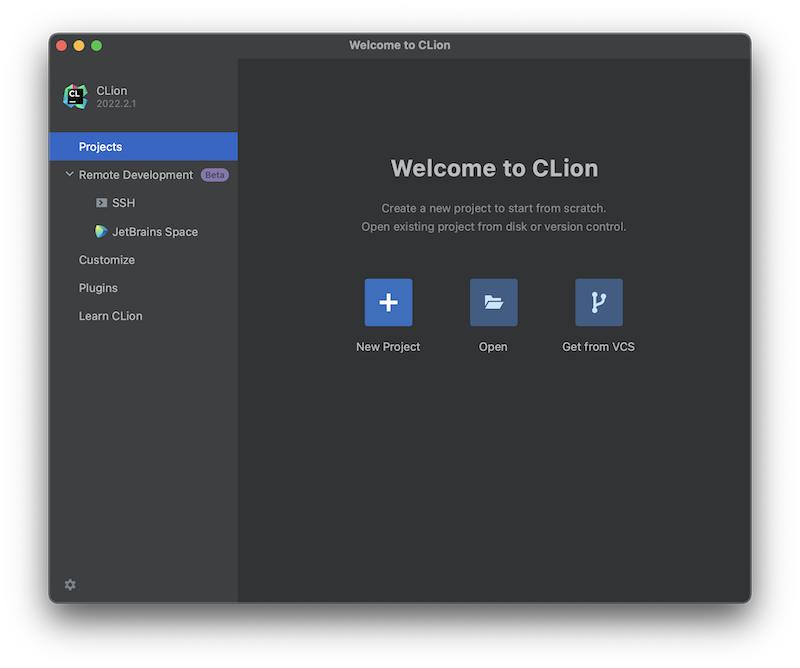

This page contains a step-by-step guide to get your programming environment 
setup on macOS.
  

## Part 1: Acquire a Free Student License from Jetbrains

---

[JetBrains](https://www.jetbrains.com) offers a wide variety of IDEs for many different 
programming languages.  Some of the IDEs they offer require a license.  However, JetBrains 
offers a free education license for students.  To get your free student license follow
the steps below.

* **Step 1:** Visit the JetBrains licensing page located 
[here](https://www.jetbrains.com/shop/eform/students).

* **Step 2:** Complete the web form **using your YCP email address**.

* **Step 3:** Check your YCP email to verify that your free JetBrains education license 
has been approved. 

* **Step 4:** Follow the directions in the email to complete setup of your JetBrains account.
You will need this account and password to confirm your license eligibility when you run
a JetBrains IDE for the first time.
   

## Part 2: Install JetBrains Toolbox App and the CLion IDE

---

The quickest and easiest way to install and update multiple JetBrains IDEs is to use the 
JetBrains Toolbox App.  Follow the steps below to install the Toolbox App and your IDEs.

* **Step 1:** Download and install the [Jetbrains Toolbox App](https://www.jetbrains.com/toolbox-app/). 
The toolbox is available for Windows, macOS, and Linux. 

* **Step 2:** After installation, run the Toolbox App.  It will appear as a cube in the 
taskbar or menu bar of your operating system.

* **Step 3:** Click on the cube to see a list of IDEs that you can install.  If this is the
first time that you've installed the Toolbox App, you may need to agree to the licensing
terms before you'll see the list of IDEs.

* **Step 4:** From within the Toolbox App, click the **Install** button next to **CLion**
to install the required IDE.  You should see a progress bar in the header of the Toolbox App.

* **Step 5:** When the installation is complete, you should be able to run the newly installed
IDE either from within the Toolbox App, or from the location at which is was installed 
on your operating system (i.e. Windows Start Menu). Run the CLion IDE now.

* **Step 6:** Respond to the prompts regarding "Data Sharing" and settings.  Then "Activate" 
your JetBrains IDE using the JetBrains account that you created earlier.  Make sure the 
"JB Account" radio button is selected, click the **Log In to Jetbrains Account...** button, 
input your account info in the web browser that appears, and then click **Activate** back in
the CLion application. Finally, click "Continue" to finish the activation and run the 
CLion IDE.

* **Step 7:** You should see a "Welcome to CLion" window similar to the image below.  From here, you can open projects by clicking the "Open" button.

> 
 

---

### Done.

--- 
