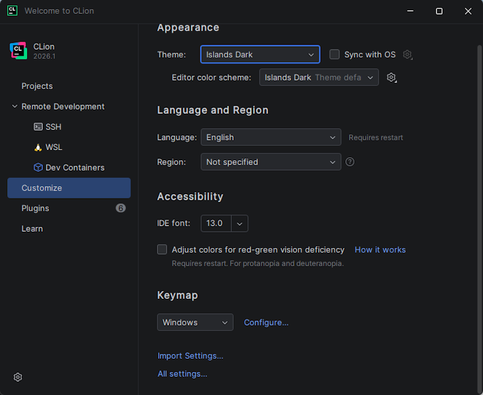
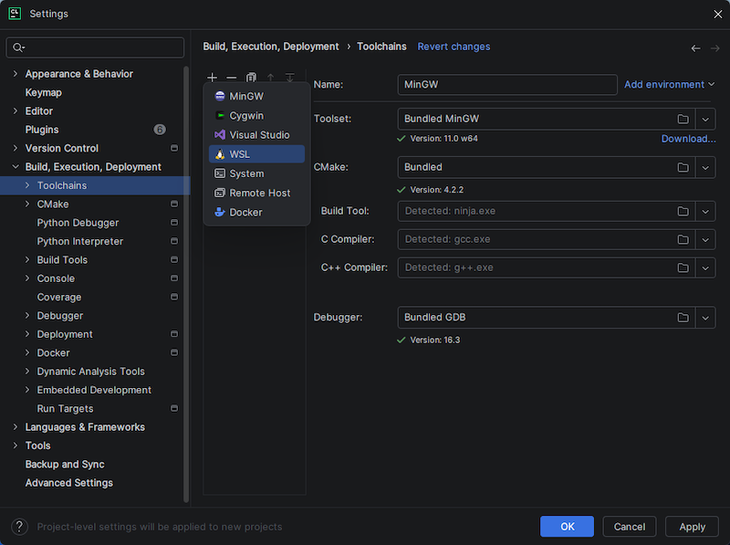
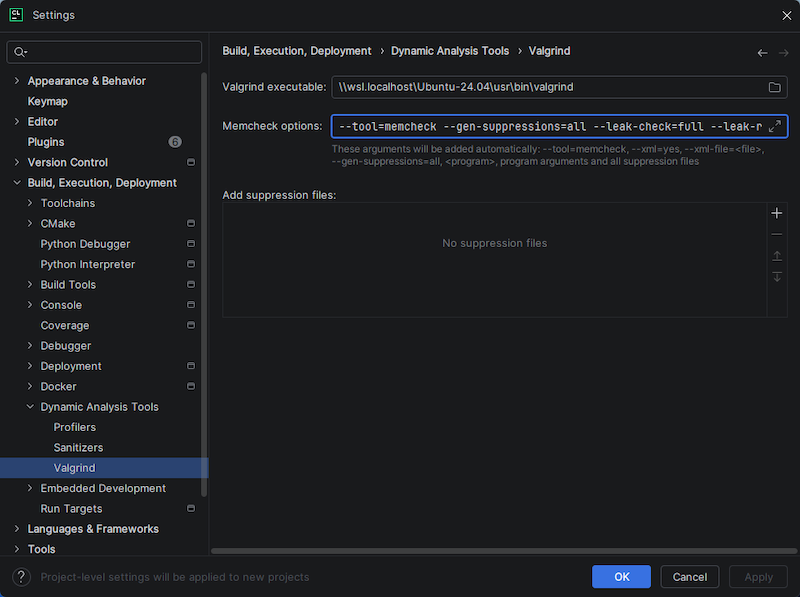

This page contains a step-by-step guide through the configuration of CLion.
<br><br>


## Configure Toolchains in CLion

---

The first time you run **CLion** you'll need to configure a variety of settings to get your 
IDE ready to compile and run your projects.  Setup will differ depending on your operating 
system.  **This guide is for Windows 11 running WSL2 with Ubuntu 24.04 LTS installed.**


* **Step 1:** Select the **Customize** menu option in the left sidebar.  Then click on 
**All settings...** at the bottom of the new dialog box.

    > 

<br>


* **Step 2:** In the **Settings** dialog box that opens, expand **Build, Execution, Deployment**,
and then select **Toolchains** in the left sidebar. At this point you may or may not have any 
toolchains setup. Click on the **+** symbol near the top of the dialog box and create a 
new **WSL** toolchain.

    > 

<br>


* **Step 3:** All the values for your new WSL toolchain _SHOULD_ autopopulate. If they don't, make sure you installed your Ubuntu Linux VM properly. Verify that your settings match those shown in the image below.  If you have multiple toolchains installed, move your new WSL toolchain to the top of the list so that it becomes the _default_ toolchain.  When done, click **Apply**.

    > 

<br>


* **Step 4:** In the left sidebar, expand **Build, Execution, Deployment**, then 
**Dynamic Analysis Tools**, and then select **Valgrind**. Copy and paste the following 
text into the **Valgrind executable** text field. **NOTE** that if you installed something 
other than Ubuntu-24.04, your path will be different. Click on the folder icon in the right of 
the text field and browse the filesystem to find your installation of valgrind. It will 
be in a similar location to the example below.

    > ```
    > \\wsl.localhost\Ubuntu-24.04\usr\bin\valgrind
    > ```


* **Step 5:** In the same **Valgrind** settings window, copy and paste the following text 
into the **Memcheck options** text field and overwrite the default settings.

    > ```
    > --tool=memcheck --gen-suppressions=all --leak-check=full --leak-resolution=med --track-origins=yes
    > ```
    
    Your **Valgrind** settings should look similar to the following when complete. Click **Apply** to save the settings.

    > 

<br>


* **Step 6:** In the left sidebar, expand **Tools** and then select **Terminal**.  Scroll down until you see the **Shell path** setting. Copy and paste the following text into the **Shell path** text field and overwrite the default setting:

    > ```
    > C:\Windows\System32\wsl.exe
    > ```

    Your **Terminal** settings should look similar to the following when complete. Click **Apply** to save the settings and then **OK** to exit the **Settings** menu.

    > 

<br><br>


---

**Continue to Final Part:** [Install YCPCS Marmoset Plugin](../common/ycpcs_marmoset_plugin.html)

--- 


